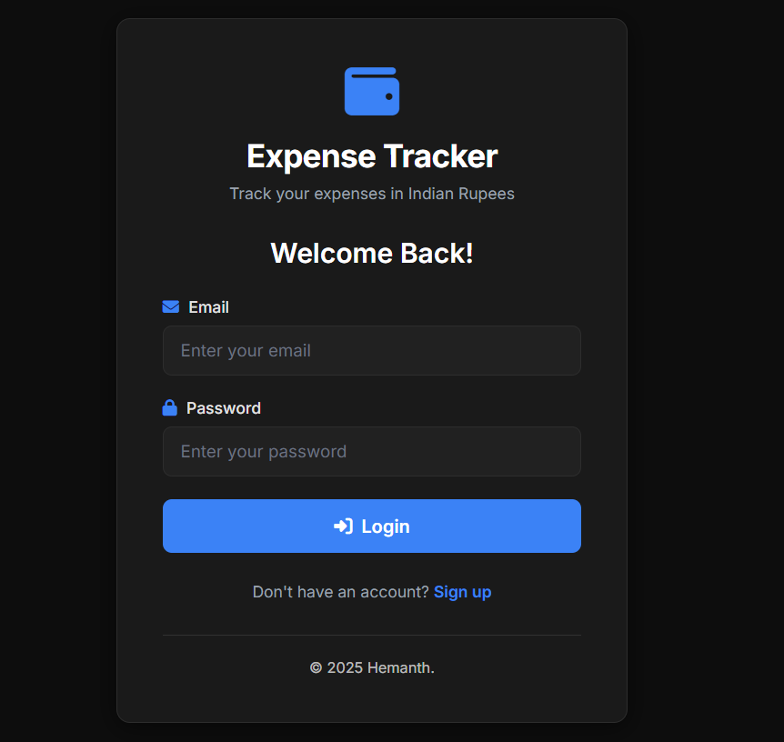
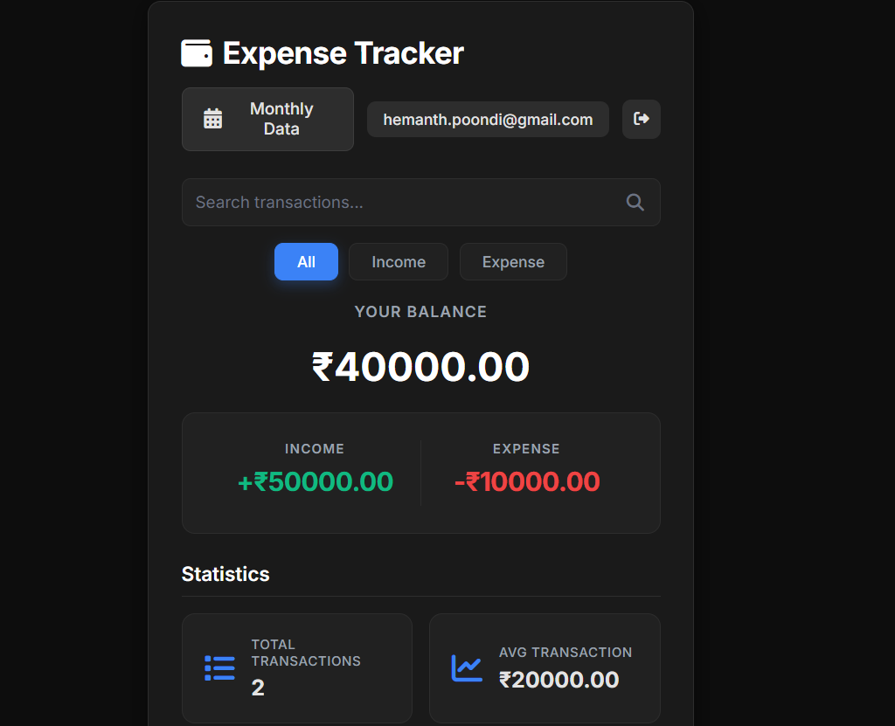
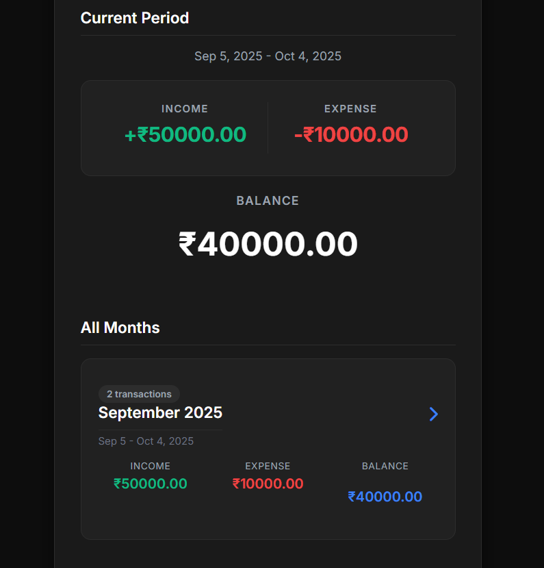

# 💰 Expense Tracker

> A modern, user-friendly web application for tracking personal expenses and income in Indian Rupees (₹). Built with vanilla JavaScript and Firebase for real-time data synchronization.

<div align="center">

[](https://expense-tracker-e4051.web.app)
[](https://firebase.google.com/)
[](https://developer.mozilla.org/en-US/docs/Web/JavaScript)

</div>

---

## 📸 Screenshots  

<p align="center">
  
  
  
</p>

---

## ✨ Features

### Core Functionality
- **Transaction Management** – Add, view, and delete income/expense transactions  
- **Real-time Balance** – Automatic calculation of current balance  
- **Category System** – 16 predefined categories with emoji icons  
- **Date Tracking** – Record transactions with specific dates  
- **Search & Filter** – Find transactions by description or category  
- **Export to CSV** – Download transaction history for external analysis  

### Monthly Data View
- **Billing Cycle Customization** – Set custom billing periods (1st, 5th, 10th, 15th, 20th, or 25th)  
- **Period-based Reports** – View income, expenses, and balance per billing period  
- **Historical Overview** – Browse past billing periods with breakdowns  
- **Current Period Summary** – Quick view of ongoing period’s financial status  

### User Experience
- **User Authentication** – Secure login/signup with Firebase Authentication  
- **Personal Data** – Each user's transactions are private and isolated  
- **Responsive Design** – Works seamlessly on desktop and mobile devices  
- **Real-time Sync** – Changes reflect instantly across all devices  
- **Statistics Dashboard** – View total transactions and average transaction amounts  

---

## 🚀 Live Demo

👉 [Expense Tracker Web App](https://expense-tracker-e4051.web.app)

---

## 🛠️ Technology Stack

- **Frontend**: HTML5, CSS3, JavaScript (ES6+)  
- **Backend & Services**: Firebase Authentication, Firestore Database, Firebase Hosting  
- **Libraries**: Font Awesome 6.4.0, Firebase SDK 9.22.0  

---

## 📦 Project Structure

```
expense-tracker/
├── index.html              # Main dashboard
├── app.js                  # Application logic
├── styles.css              # Stylesheet
├── auth.html               # Login/Signup page
├── auth.js                 # Authentication logic
├── auth-styles.css         # Auth page styles
├── monthly-view.html       # Monthly data view
├── monthly-view.js         # Monthly view logic
├── monthly-styles.css      # Monthly view styles
├── firebase-config.js      # Firebase config
├── firebase.json           # Hosting config
├── .firebaserc             # Firebase project settings
├── assets/
│   └── screenshots/
│       ├── authentication.png
│       ├── dashboard.png
│       └── monthly-view.png
```

---

## 🔐 Security Features

- Firebase Authentication required  
- User isolation (private data per account)  
- Firestore security rules  
- HTTPS secure hosting  

---

## 📱 Responsive Design

Optimized for:  
- Desktop & laptops  
- Tablets  
- Mobile devices  

---

## 🚦 Getting Started

### Prerequisites
- Modern web browser (Chrome, Firefox, Safari, Edge)  
- Firebase account (for deployment)  

### Local Development

1. **Clone the repository**
   ```bash
   git clone <repository-url>
   cd expense-tracker
   ```

2. **Update Firebase credentials**
   - Open `firebase-config.js`
   - Replace with your Firebase project credentials

3. **Run locally**
   - Option 1: Open `index.html` directly in browser
   - Option 2: Use a local server
     ```bash
     python -m http.server 8000
     ```
   - Access at `http://localhost:8000`

### Firebase Setup

1. **Create Firebase Project**
   - Go to [Firebase Console](https://console.firebase.google.com)
   - Click "Add Project" and follow the wizard

2. **Enable Authentication**
   - Navigate to Authentication → Sign-in method
   - Enable Email/Password provider

3. **Create Firestore Database**
   - Navigate to Firestore Database
   - Click "Create Database"
   - Start in production mode
   - Set up security rules

4. **Get Configuration**
   - Go to Project Settings → General
   - Scroll to "Your apps" section
   - Copy the Firebase config object
   - Paste into `firebase-config.js`

### Deployment

```bash
# Install Firebase CLI
npm install -g firebase-tools

# Login to Firebase
firebase login

# Initialize project (first time only)
firebase init

# Deploy to Firebase Hosting
firebase deploy
```

**Your app will be live at**: `https://your-project-id.web.app`

---

## 🎯 Key Features Explained

### 📂 Transaction Categories
- 🍔 Food, 🛒 Groceries, 🏠 Utilities
- 💊 Health, 🛡️ Insurance, $ EMI/Credit
- 💹 Investment, 🚗 Transport, 🛍️ Shopping
- 🎬 Entertainment, 💡 Bills, 💰 Salary
- 🎁 Gift, $ Loan, 📌 Other

### 🔍 Filter Options
- **All Transactions** – View complete transaction history
- **Income Only** – Filter to show only income entries
- **Expense Only** – Filter to show only expense entries

### 📊 Statistics Dashboard
- **Total Transactions** – Count of all recorded transactions
- **Average Transaction** – Mean value of all transactions
- **Balance** – Current balance (Income - Expenses)
- **Total Income** – Sum of all positive transactions
- **Total Expense** – Sum of all negative transactions

---

## 📅 Monthly Data Feature

The Monthly Data view provides comprehensive billing period analysis:

- **Custom Billing Cycles** – Choose when your billing period starts (1st, 5th, 10th, 15th, 20th, or 25th)
- **Period Breakdown** – See income, expenses, and balance for each period
- **Historical Data** – Access all past billing periods
- **Quick Navigation** – Click any period to view detailed transactions

**Perfect for**: Salary-based tracking, credit card bill management, and budget monitoring.


---

## 🎨 Design Highlights

- **Modern UI** – Clean and intuitive interface
- **Color-coded Transactions** – Green for income, red for expenses
- **Smooth Animations** – Hover effects and transitions
- **Loading States** – Visual feedback during data operations
- **Error Handling** – User-friendly error messages

---

## 🔄 Data Flow

```
User Authentication (Firebase Auth)
         ↓
Load User Transactions (Firestore)
         ↓
Real-time Listener (Auto-sync)
         ↓
User Actions (Add/Delete)
         ↓
Update Firestore
         ↓
Sync Across All Devices
```

---

## 🌐 Browser Support

| Browser | Support |
|---------|---------|
| Chrome/Edge | ✅ Latest |
| Firefox | ✅ Latest |
| Safari | ✅ Latest |
| Mobile Browsers | ✅ iOS Safari, Chrome Mobile |

---

## 🚀 Future Enhancements

- [ ] Budget setting and tracking
- [ ] Recurring transactions
- [ ] Data visualization with charts
- [ ] Multi-currency support
- [ ] Receipt attachment capability
- [ ] Advanced reporting features
- [ ] Dark mode theme
- [ ] Expense categories customization

---

## 📞 Support

For issues or questions:

1. **Firebase Console** – Check for errors in Firebase Console
2. **Browser Console** – Press F12 to view debugging information
3.. **Common Issues** – See [Firebase Deployment Guide]

---

## 📝 License

© 2025 Hemanth. MIT License

---

## 🤝 Contributing

This is a personal project. Feel free to fork and modify for your own use.

---

<div align="center">

**Built with ❤️ using Firebase and Vanilla JavaScript**

[⬆ Back to Top](#-expense-tracker)

</div>